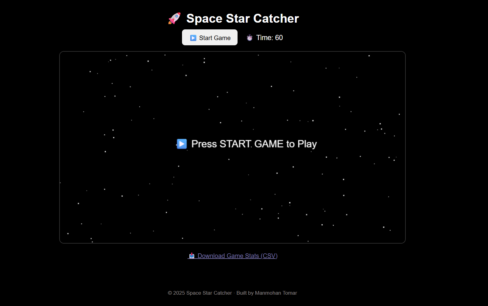
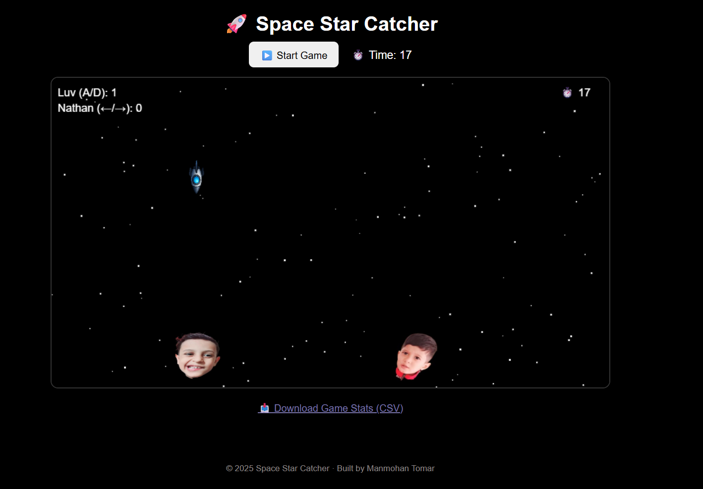
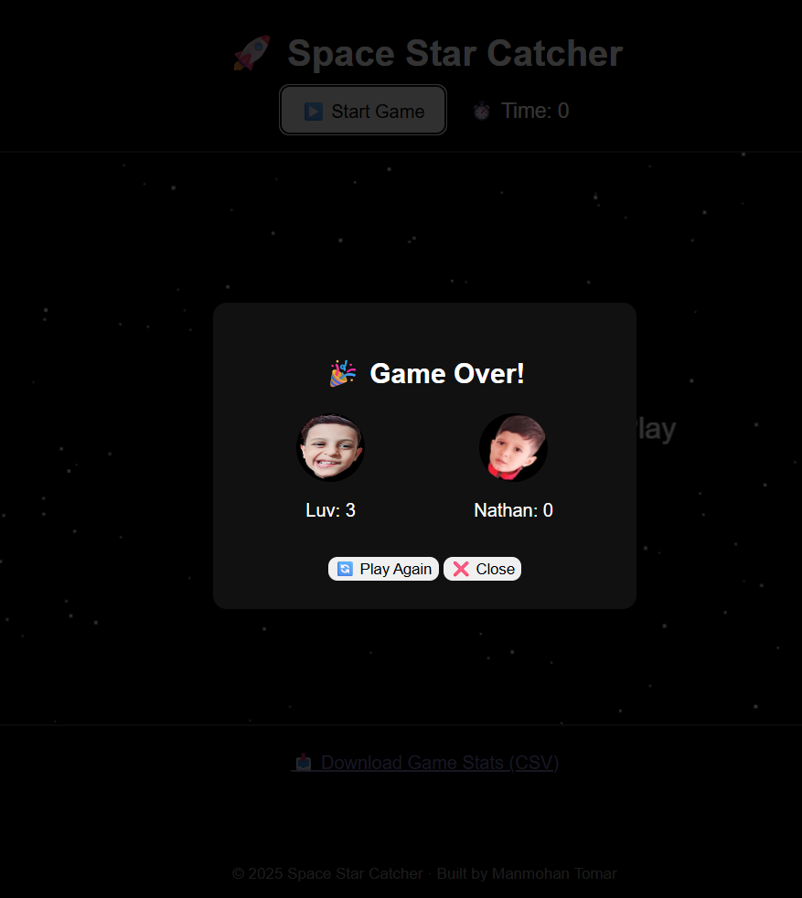

## Space Rocket Catcher with AI

A browser-based canvas game with:
- Flask backend
- AI-generated hints
- NumPy for numerical decisions
- Pandas for gameplay analytics
- Speech synthesis for dual-player voices

## Tech Stack
- Python (Flask)
- JavaScript (Canvas)
- NumPy, Pandas
- OpenAI API

## Game Preview

